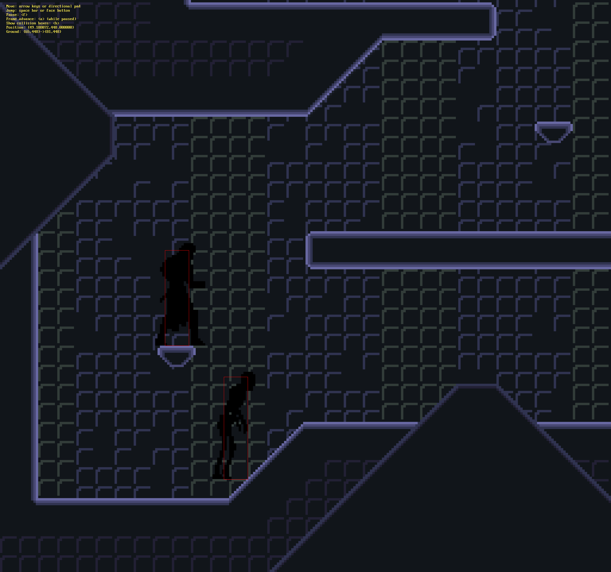

# ULTRA240 Example

This is a sandbox level I use to test new features for the
[ULTRA240](https://github.com/3snowp7im/ultra240) game library.



While I plan on eventually providing this software with an open source license,
it is currently UNLICENSED. You may use and modify it as you see fit, however
you may not distribute it in any form for any reason.

## Recommended software

* [Tiled](https://mapeditor.org) - Tool used for designing maps, animations, and
  metadata.

## Building

### Build dependencies

You will first need to build and install
[ULTRA240](https://github.com/3snowp7im/ultra240)
and
[ULTRA240 SDK](https://github.com/3snowp7im/ultra240-sdk).

You will need to install SDL2 and Wayland development libraries. To install
these dependencies on Ubuntu:

```shell
$ sudo apt-get install libsdl2-dev libwayland-dev
```

This example uses [BGFX](https://github.com/bkaradzic/bgfx) for establishing
a graphics context. BGFX and its dependencies are included as submodules which
must be checked out before building:

```shell
$ git submodule update --init
```

### Building a non-release version

There are currently no release versions of the code. To build from the current
working version, install the GNU autotools.

To install autotools on Ubuntu:

```shell
$ sudo apt-get install autoconf automake
```

Next, checkout the software and generate the `configure` script:

```shell
$ autoreconf --install
```

It is recommended to build the software outside the source directories:

```shell
$ mkdir build
$ cd build
$ ../configure --enable-debug
```

Finally, build and install the software:

```shell
$ make
$ sudo make install
```
